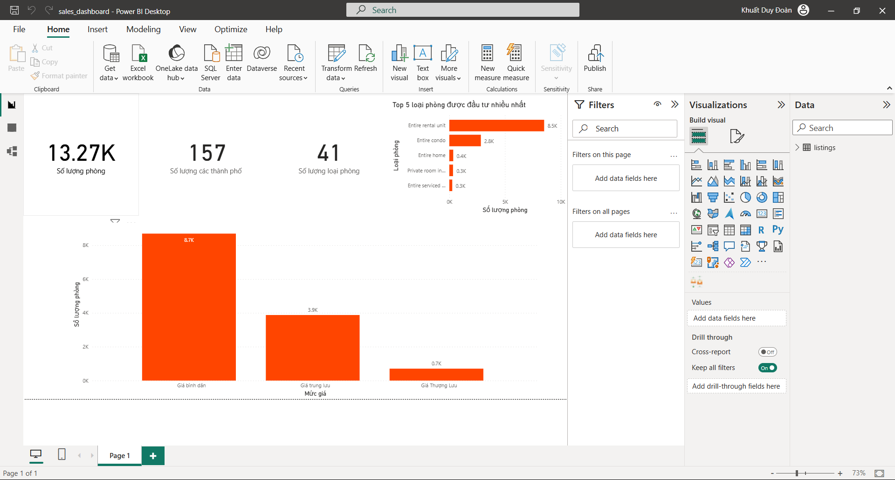

# Sales Performance Analysis

## Overview
This project analyzes sales performance data using Python and Power BI to identify business trends, evaluate key performance indicators (KPIs), and support data-driven decision-making.

## Tools Used
- Python
- Power BI
- Pandas
- Matplotlib
- Seaborn

## Objectives
- Analyze overall sales performance
- Identify top-performing products and categories
- Explore customer purchasing behavior
- Visualize business KPIs through interactive dashboards

## Data Processing
- Cleaned and transformed raw sales data
- Performed exploratory data analysis (EDA)
- Prepared data for dashboard visualization and reporting

## Key Insights
- Certain product categories generated significantly higher revenue
- Sales performance varied across customer segments
- Business trends revealed opportunities for improving sales strategies
- Dashboard visualization improved KPI tracking and business monitoring

## Dashboard Preview

### Sales Dashboard Overview

## Files Included
- `sales_analysis.ipynb` → exploratory data analysis
- `sales_dashboard.pbix` → Power BI dashboard
- `sales_data.csv` → dataset used for analysis
- `project_report.pdf` → project documentation and presentation
